```{r setup, include=FALSE}
knitr::opts_chunk$set(echo = TRUE)
```

<br>

## Introduction


This Shiny app allows to perform Gene Ontology (GO) enrichment analysis, pathway analysis and GSEA analysis using clusterProfiler, an flexible R package for functional analysis.
( <http://bioconductor.org/packages/release/bioc/html/clusterProfiler.html> ).

The entry point for the app is a result table from a Differential Expression (DE) analysis of a RNA-Seq experiment (e.g. from DESeq2 or EdgeR). The table should have at least 5 columns:

* **GENE ID**: these can be either **Gene Symbols** or **Ensembl ID** - **Gencode IDs** are also supported;
* **MEAN EXPRESSION** (**NOT** log transformed, as in standard output for DESeq2);
* **LOG2 FOLD CHANGE**;
* **P-VALUE**;
* **ADJUSTED P-VALUE**;

Also, the app expects a **NOT FILTERED** result table (this means that the table should report all genes that entered the DE analysis pipeline, including genes for which the adjusted pvalue = NA).


You can also use this app if you have several cluster of genes and you want to compare which GO term is associated with each cluster. In this case, the entry point is a table with at least 2 columns:

* **GENE ID**: these can be either **Gene Symbols** or **Ensembl ID** - **Gencode IDs** are also supported;
* **CLUSTER**: the cluster to which each gene belongs.

<br><br>


## 1. Load Data

To load your DEG table, go to the **Upload Panel**, and click the **Browse** bottom. You can select the DE analysis result table that you want to import. When the upload is completed, the imported table will be displayed on the **Input Table** panel. 

Select the model organism that you are working with (3 species are currently supported: **Mus musculus**, **Homo sapiens** and **Drosophila melanogaster**). Next, you can select which column is the **Gene Names/IDs**. You can specify whether the IDs are **Symbol** or **Ensembl** by cliking on the corresponding button. In the same way, you proceed by selecting which columns store the **Mean Expression**, **Log2 Fold Change**, **pvalue** and **adjusted pvalue**. 

Once this operation has been completed, you are ready to visualize the results of your DE analysis by clicking on the **MAplot - Volcano Plot** panel.
 
<br>

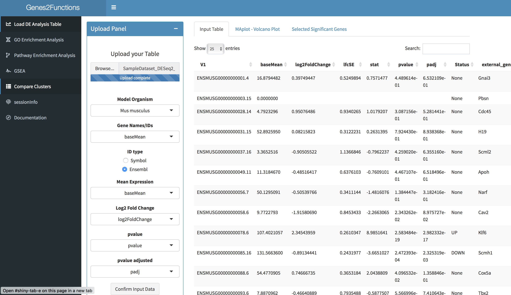

<br><br>
 
## 2. Visualize DE Analysis

The panel **MAplot - Volcano Plot** shows - guess what? - an MA-plot and a Volcano Plot for your data. 

You can define a custom **adjusted pvalue threshold** for significance and a custom **fold change threshold** for significance (NOTE: this is **NOT** in log scale, so if you want to select genes whose expression is twice as high compared to your reference sample, you just select **2**).

Every time you will change these values, the plots will be updated. Below, a **summary** will tell you the total number of significantly differential genes, and the number of significantly up- and down-regulated genes.

If you want to see which genes have passed your significance threshold, you can move to the **Selected Significant Genes** panel.

It is at this stage that you are defining the genes that will be tested in the following GO enrichment analysis. 
 
<br>

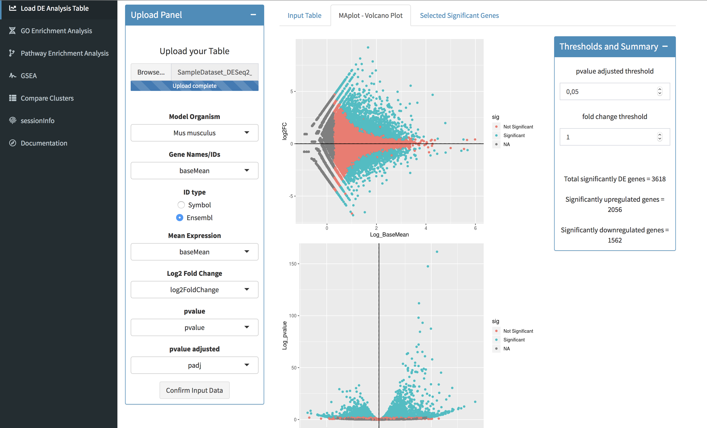

<br><br> 
 
## 3. GO Enrichment Analysis

Once you are happy with your significance thresholds, you can click on the **GO Enrichment Analysis** panel that you find on the left sidebar. 

In the landing page, you will find a **Control Panel** that will allow you to define the parameters of your analysis. Below, a venn diagram will summarize the number of genes that will enter the GO enrichment analysis.

In the **Control Panel**, you can refine your **target set**: in the **Target Set** drop-down window, you choose if you want to run the test on the total DE genes, or on the subsets of significantly up- or down-regulated genes separately. Eventually, you can chose whether you want to use only expressed gene or all genes as **background** for your analysis (NOTE: **Expressed Genes** will discard genes with a padj = NA, while **All Genes** will select all genes in your imported table). 
 
<br>


<br> 
   
You can further refine the analysis paramenters by clicking on the **Parameters** sub-panel. In here, you can choose the **Type of Analysis** (only **GO over-representation test** is currently available), the **Subontology** (**Molecular Functions**, **Biological Processes**, **Cellular Compartments** or **All**), the **pvalue threshold**, the **qvalue threshold** and the **pvalue adjust method**.
 
<br>
<center>
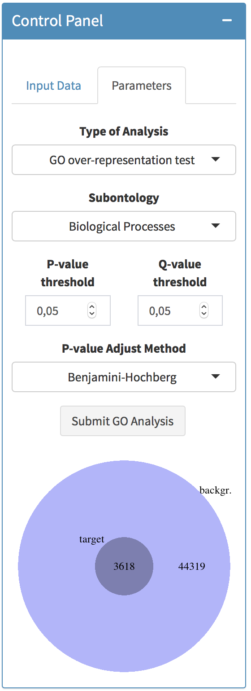{height=400px, width=200px}
</center>

<br>

Once all parameters are set, click on **Submit GO Analysis** button to start the analysis.

<br><br>
 
## 4. Visualize and Download results
 
The analysis takes few minutes to run. Once completed, you can visualize the result of your GO enrichment analysis by clicking on the **Visualization** panel. 
 
You can choose between three types of visualization: **Barplot**, **Dotplot** and **Emapplot**. You can tweek the number of significant GO terms to show in each plot using the small panel on the right. If you want to **download** the graphs, right-click on the images and save it on your computer.

<br>

### Barplot

The x-axis of a Barplot reports the number of genes associated with each enriched GO term (gene count). Each bar is colored according to the significance of its respective GO term.

<br>

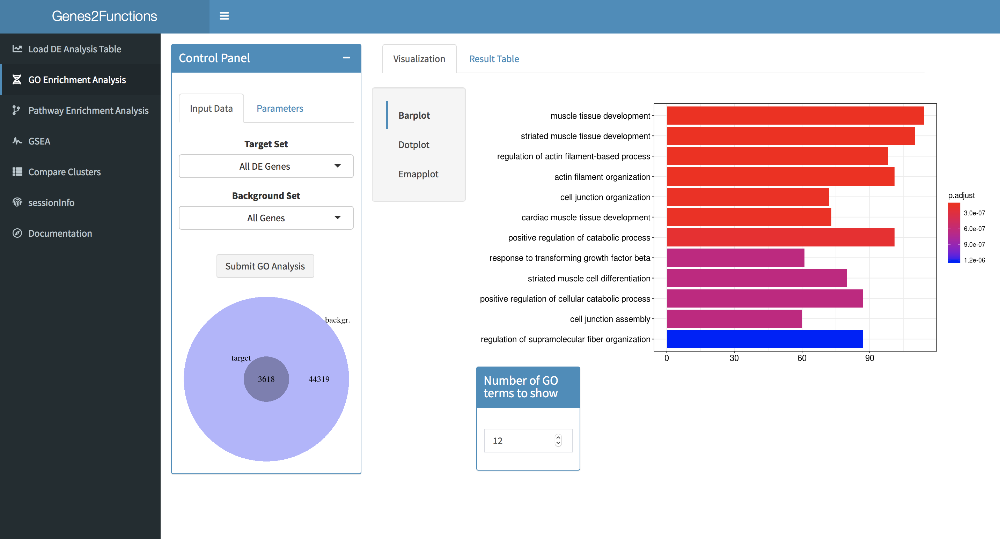
 
<br> 

### Dotplot
 
The x-axis of a Dotplot reports the gene ratio for each enriched GO term. The gene ratio is the ratio between the number of genes belonging to a given gene-set that are present in the target set and the total number of genes present in the target set. The size of each dot is proportional to the gene count, and the color is mapped to the adjusted p-value of the corresponding GO term.

<br> 

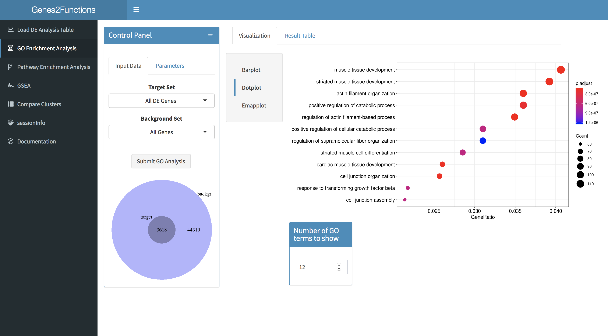

<br>
  
### Emapplot

Enrichment map organizes enriched terms into a network with edges connecting overlapping gene sets. In this way, mutually overlapping gene sets are tend to cluster together, making it easy to identify functional module.

<br>

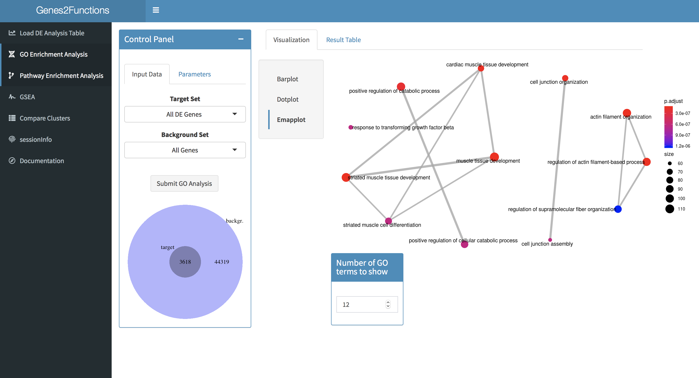

<br> 

By clicking on the **Result Table** panel, you can visualize the result of your analysis in a table format. This is the way to go if you want to understand which genes are associated with each significant GO term. You can **download** the table by clicking on the **Download** button above the result table.

<br>
 
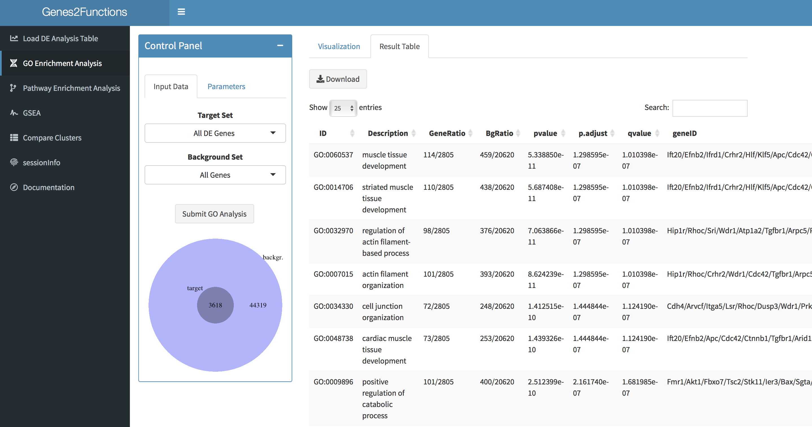

 
<br><br>
 
## 5. Pathway Enrichment Analysis 
 
If you want to know whether your set of DE genes comprises over-represented genes associated with certain annotated pathways, you can click on the **Pathway Enrichment Analysis** tab on the left-side panel.

The process is very similar to the GO Enrichment Analysis workflow: in the **Control Panel** you can specify the target set and the background set. In the **Parameters** tab, you can select which database you want to use for the analysis (currently, you can choose between wikipathway and MSigDB. If you choose the latter, you can further specify which sub-category(s) you want to work with. You can choose any combination of **Hallmark gene sets**,**Positional gene sets**,**Curated gene sets**,**Motif gene sets**,**Computational gene sets**,**GO gene sets**,**Oncogenic gene sets** and **Immunologic gene sets**). Next, you can set the significance thresholds and specify the p-value adjust method.

When you are ready, you can click on the **Submit Pathway Analysis** button. The result will be visualized on the same page. You can visualize the result of your analysis using a barplot, a dotplot or enrichment map as in the GO Enrichment Analysis, or using a **Gene Concept Network** (cnetplot). A **Gene Concept Network** depicts the linkages of genes and biological concepts (e.g. enriched wikipathays/MSigDB terms) as a network.

You can Download the result of your pathway analysis in a table format by clicking on the **Result Table** tab, and on the **Download** button

<br>
 
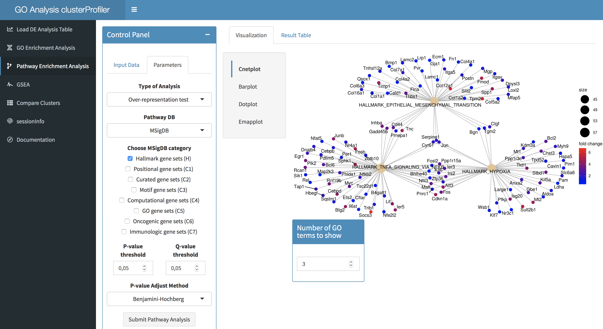
 
<br><br>
 
## 6. GSEA

Gene Set Enrichment Analysis (GSEA) is an alternative statistical procedure to the standard over-representation tests (hypergeometric and/or binomial tests) for the identification of deregualted gene sets. GSEA does not identify over-represented genes present in a target set compared to a background, but instead uses a ranked gene list. For a detailed explanation of the method, please refer to PMCID: PMC1239896.  

In this GSEA implementation, genes are ranked according to their Log2 fold change. In the **Parametrs** tab of the **Control Panel**, you can specify which database to use for your analysis (Wikipathway or MSigDB). 

Click on the **Submit GSEA Analysis** to start the analysis. The result of the analysis will be displayed in the same page. You can visualize each **Enrichment Plot** associated with significant sets by clicking on the tab **Running Score**.  
 
<br> 
 
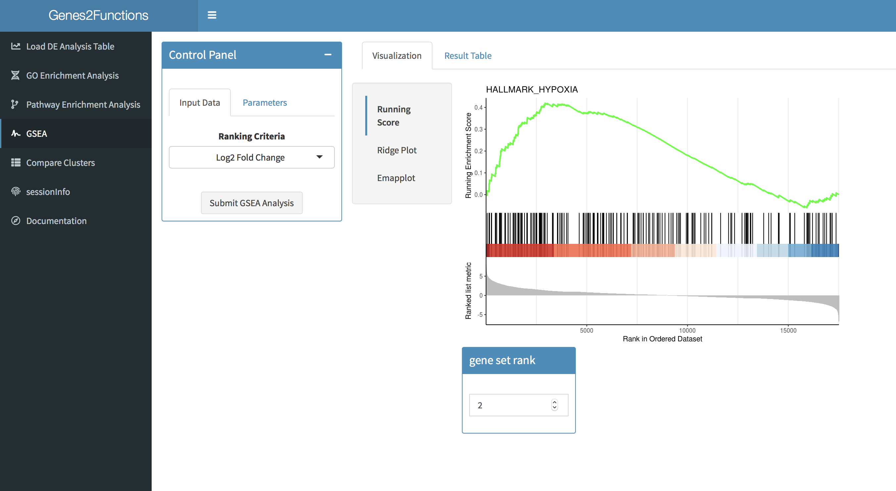
 
<br>

You can also visualize a set of enriched pathways by clicking on the **Ridge Plot** tab. The Ridge Plot will visualize expression distributions of core enriched genes (leading edge subset) for GSEA enriched categories. It helps to interpret up/down-regulated pathways.

<br> 
 
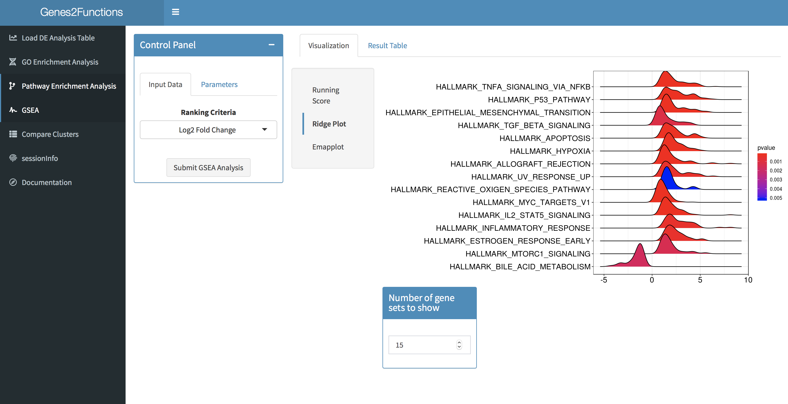

<br>

You can Download the result of your GSEA pathway analysis in a table format by clicking on the **Result Table** tab, and on the **Download** button.

<br><br>

## 7. Compare Clusters

If you want to compare clusters of genes and identify enriched GO terms specific for each, click to the **Compare Clusters** panel on the left sidebar. 

If you want to expand on the GO term analysis from the DE analysis, select from the **Input Panel**, import **From DE analysis (Up vs Down)**. After selecting the **Subontology** of preference, click on **Submit Compare Cluster Analysis** button. The analysis will yield enriched GO terms for the comparison up-regulated VS down-regulated genes. By clicking on the **Result Table** panel, you can visualize and download a detailed result table. 

<br>

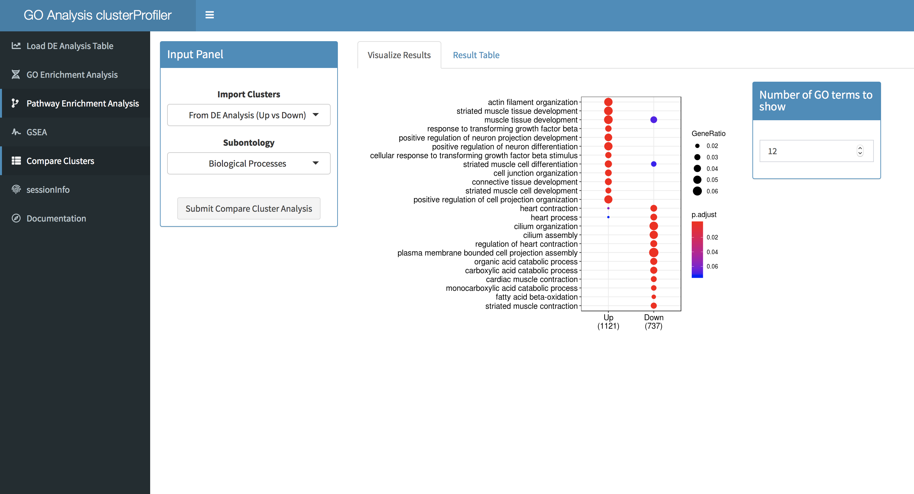
<br><br>   

If you want to characterize previously clustered groups of genes, choose to **Import Clusters From Table** from the top **Input Panel**.
You can import a table in tsv (tab separated values) format, with at leat 2 columns:
  
  * **Gene Names / IDs**
  * **Clusters**

Once the upload is completed, use the drop-down menus **Gene Names/IDs** and **Clusters** to select which columns of your input table hold the respective information. Select whether gene identifiers are **Symbol** or **Ensembl** IDs (Gencode IDs are supported) using the **ID type** buttons. You can visualize the selected data on the **Input Table** panel on the main page.
Click on **Confirm Cluster Column** to confirm your choices. Then, you can select which clusters to include in the analysis by (de)selecting them. Next, select the **Model Organism** and the **Subontolgy**. Click on the **Submit Compare Clusters Analysis** to start your analysis.

<br>

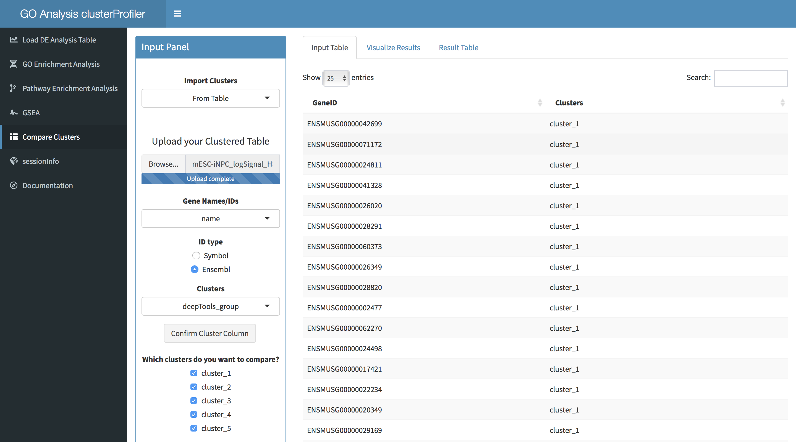
<br><br>  
 
Result of your analysis will be displayed as a dotplot in the **Visualize Results** panel. You can choose the number of terms to shows in the graph using corresponding box. As before, you can visualize and download a **Result Table** by clicking on the homonomous panel.   

<br>
 
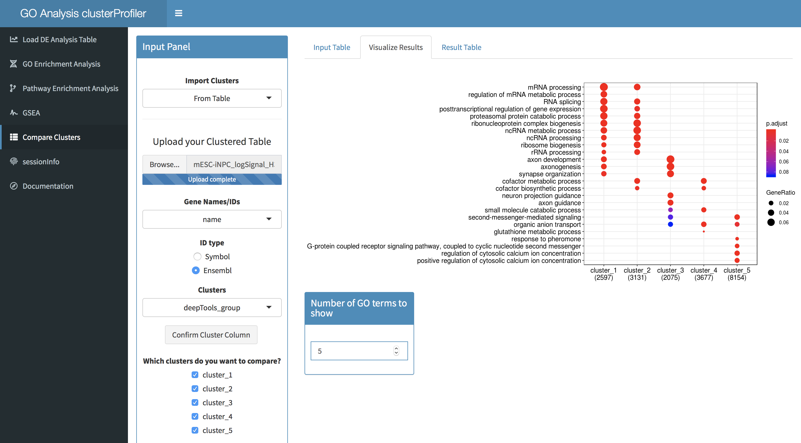  
<br><br>


## SessionInfo

The **sessionInfo** panel summarises the details of the R environment used for the analysis. This is usefull if you want to reproduce your results years from now, as it specifies the version of the packages used.   
 
<br> 

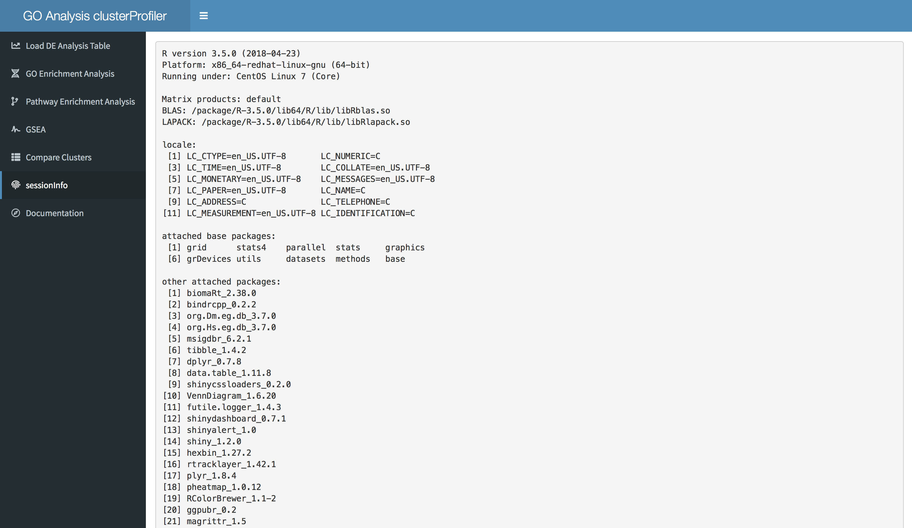

<br>

***

<br>

If you use this app in your research, make sure to cite clusterProfiler:

Yu G, Wang L, Han Y, He Q (2012). “clusterProfiler: an R package for comparing biological themes among gene clusters.” OMICS: A Journal of Integrative Biology, 16(5), 284-287. doi: 10.1089/omi.2011.0118.

<br><br><br><br>